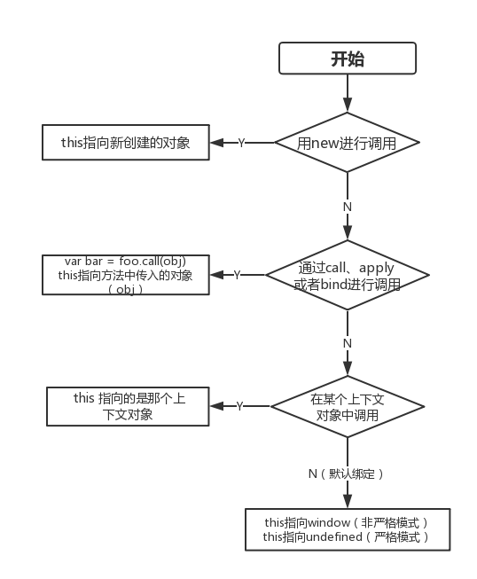

# this解析
<!--  -->


## this是什么？
this 是在运行时(函数被调用时)进行绑定的，并不是在编写时绑定,它的上下文取决于函数调用时的各种条件。this的绑定和函数声明的位置没有任何关系，只取决于函数的调用方式。下面是this可以获得新值的6中方式：
```text
1.this在全局范围内。
2.this在对象的构造函数内。
3.this在对象的方法内。
4.this在一个简单的函数内。
5.this在箭头函数内。
6.this在一个事件侦听器内。
```
## this的绑定规则
### 1.默认绑定
默认绑定就是独立函数调用；例：
```js
function foo() {
  // "use strict";
  console.log(this.a);
}
var a = 1;
foo();// 1
```
foo方法中的this.a被解析成了全局变量a，因为foo是在全局作用域中调用的所以this也就指向了全局变量。但在严格模式的情况下执行纯粹的函数调用，那么这里的的 `this` 并不会指向全局，而是 `undefined`。
### 2.隐式绑定
函数调用时，若被某个对象拥有，隐式绑定规则会把函数调用中的 this 绑定到这个上下文对象中。
```js
function foo() {
  console.log( this.a );
}
var obj = {
  a: 1,
  foo: foo
};
obj.foo(); // 1
```
虽然foo方法的声明是在全局作用域中，但它的调用是在obj对象的上下文里，所以this会被隐式绑定到obj中；即this.a 和 obj.a 一样。
#### 隐式丢失
平时的开发中可能会遇到一个问题，就是被隐式绑定的函数会丢失绑定对象，例1：
```js
function foo() {
  console.log(this.a);
}
var obj = {
  a: 1,
  foo: foo
};
var bar = obj.foo;
var a = 2;
bar(); // 2
```
`var bar = obj.foo`中bar引用了foo函数本身，`bar()`调用时并没有处在`obj`的上下文中，这是应用了默认绑定。

还有将foo当做回调方法也会导致`this`绑定的丢失，例2：
```js
var a = 2;
setTimeout(foo, 1000);
// 或
function Fun(callback) {
	callback();
}
Fun(foo);
```
其实，把foo当做回调方法就相当于例1中的`var bar = obj.foo`一样，给`callbak`赋值。
### 3.显示绑定
在隐式绑定中，我们必须在一个对象内部包含一个指向某个函数的属性，并通过这个属性来引用函数，间接的将`this`绑定到对象上。而显式绑定则可以通过`call(...)`和`apply(...)`对this进行绑定。它们的第一个参数是一个对象，它们会把这个对象绑定到this ，接着在调用函数时指定这个 this 。
```text
call和apply 区别
call(obj, arg1, arg2, ...)
apply(obj, [agr1, arg2, ...])
```
```js
function foo() {
	console.log(this.a);
}
var obj = {
	a: 1
};
foo.call(obj); // 1
```
#### 1.硬绑定
```js
function foo() {
  console.log( this.a );
}
var obj = {
  a:2
};
var bar = function() {
  foo.call( obj );
};
bar(); // 2
setTimeout( bar, 100 ); // 2
bar.call( window ); // 2
```
除了`call(...)`和`apply(...)`，还有`bind()`可以对this进行绑定，`bind()`是ES5中提供的内置方法，属于硬绑定(bind应用柯里化)
#### 2.API调用的“上下文”
JavaScript 语言和宿主环境中许多新的内置函数，都提供了一个可选的参数，通常被称为“上下文”（context），其作用和 bind(..) 一样，确保你的回调函数使用指定的 this 。

像Array的5个改变函数上下文的方法：
```js
Array.prototype.every(callbackfn [, thisArg ])
Array.prototype.some(callbackfn [, thisArg ])
Array.prototype.forEach(callbackfn [, thisArg ])
Array.prototype.map(callbackfn [, thisArg ])
Array.prototype.filter(callbackfn [, thisArg ])
```
例子：
```js
function foo(el) {
  console.log( el, this.id );
}
var obj = {
  id: "awesome"
};
// 调用 foo(..) 时把 this 绑定到 obj
[1, 2, 3].forEach( foo, obj );
// 1 awesome 2 awesome 3 awesome
```
在上面例举的6种this获取新值的方法中，箭头函数和事件监听都属于显示绑定。
```text
箭头函数：
this在箭头函数中总是跟它在箭头函数所在作用域的this一样(在它直接作用域)
事件监听：
当使用 addEventListener() 为一个元素注册事件的时候，句柄里的 this 值是该元素的引用。其与传递给句柄的 event 参数的 currentTarget 属性的值一样。
```
### 4.new绑定
JavaScript中的构造函数其实就是用`new`来调用函数，会发生以下操作：
```text
1. 创建（或者说构造）一个全新的对象。
2. 这个新对象会被执行 [[ 原型 ]] 连接。
3. 这个新对象会绑定到函数调用的 this 。
4. 如果函数没有返回其他对象，那么 new 表达式中的函数调用会自动返回这个新对象。
```
```js
function Obj (value) {
    this.a = value;
}
let obj1 = new Obj(1);
let obj2 = new Obj(2);

console.log(obj1.a); // 1
console.log(obj2.a); // 2
```
使用`new`来调用`Obj()`的时候，会构造一个新的对象并把它绑定到`Obj()`中。
### 箭头函数
this在箭头函数中总是跟它在箭头函数所在作用域的this一样(在它直接作用域). 所以, 如果你在对象中使用箭头函数, 箭头函数中的this总是指向这个对象本身。
```js
function foo() {
  // 返回一个箭头函数
  return (a) => {
    //this 继承自 foo()
    console.log( this.a );
  };
}
var obj1 = {
  a:2
};
var obj2 = {
  a:3
};
var bar = foo.call( obj1 );
bar.call( obj2 ); // 2, 不是 3 ！
```
## 优先级
#### 1. 默认绑定与隐式绑定优先级比较
```js
function foo() {
    console.log(this.a);
}
var a = 1;
var obj = {
    a: 2,
    foo: foo
}
foo();     // 1
obj.foo(); // 2
```
结果： 隐式绑定 > 默认绑定
#### 2. 显示绑定与隐式绑定优先级比较
```js
function foo() {
    console.log( this.a );
}
var obj1 = {
    a: 2,
    foo: foo
};
var obj2 = {
    a: 3,
    foo: foo
};
obj1.foo(); // 2
obj2.foo(); // 3
obj1.foo.call( obj2 ); // 3
obj2.foo.call( obj1 ); // 2
```
结果：显示绑定 > 隐式绑定
#### 3.new绑定与显示绑定优先级比较
new绑定会使用新创建的 this 替换硬绑定的 this 。
```js
function foo(something) {
    this.a = something;
}
var obj1 = {};
var bar = foo.bind( obj1 );
bar( 2 );
console.log( obj1.a ); // 2
var baz = new bar(3);
console.log( obj1.a ); // 2
console.log( baz.a ); // 3
```
结果：new绑定 > 显示绑定

优先级：new绑定 > 显示绑定 > 隐式绑定 > 默认绑定