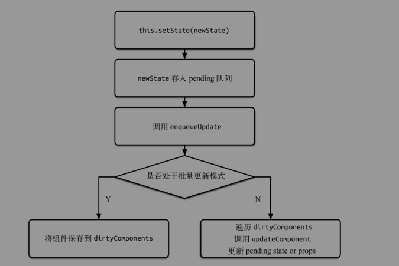

# React -- setState
## setState主要流程
1. enqueueSetState将state放入队列中，并调用enqueueUpdate处理要更新的Component。
2. 如果组件当前正处于update事务中，则先将Component存入dirtyComponent中。否则调用batchedUpdates处理。
3. batchedUpdates发起一次transaction.perform()事务。
4. 开始执行事务初始化，运行，结束三个阶段
```text
a. 初始化：事务初始化阶段没有注册方法，故无方法要执行
b. 运行：执行perform()传入的method。
c. 结束：更新isBatchingUpdates为false，并执行FLUSH_BATCHED_UPDATES这个wrapper中的close方法。
```
5. FLUSH_BATCHED_UPDATES在close阶段，会循环遍历所有的dirtyComponents，调用updateComponent刷新组件，并执行它的pendingCallbacks, 也就是setState中设置的callback。

## 将要更新的state放入队列中
```js
// ReactCompnent.js
ReactComponent.prototype.setState = function (partialState, callback) {
  // ...略
  this.updater.enqueueSetState(this, partialState);
  if (callback) {
    this.updater.enqueueCallback(this, callback, 'setState');
  }
};
// ReactUpdateQueue.js
  enqueueSetState: function (publicInstance, partialState) {
    // ...略
    var queue = internalInstance._pendingStateQueue || (internalInstance._pendingStateQueue = []);
    // 将要更新的state存入queue中
    queue.push(partialState);

    enqueueUpdate(internalInstance);
  }
```
## 开启事务或将要更新的组件存入队列
```js
// ReactUpdates.js
function enqueueUpdate(component) {
  ensureInjected();

  // 如果组件当前正处于update事务中，则将组件存入dirtyComponents中，否则就去开启事务。
  if (!batchingStrategy.isBatchingUpdates) {
    batchingStrategy.batchedUpdates(enqueueUpdate, component);
    return;
  }

  dirtyComponents.push(component);
  if (component._updateBatchNumber == null) {
    component._updateBatchNumber = updateBatchNumber + 1;
  }
}
```
## batchedUpdates开启事务
```js
// ReactDefaultBatchingStrategyjs
var RESET_BATCHED_UPDATES = {
  initialize: emptyFunction,
  close: function () {
    ReactDefaultBatchingStrategy.isBatchingUpdates = false;
  }
};

var FLUSH_BATCHED_UPDATES = {
  initialize: emptyFunction,
  close: ReactUpdates.flushBatchedUpdates.bind(ReactUpdates)
};

// 在事务初始化和结束时会分别调用他们的initialize和close；其中RESET_BATCHED_UPDATES.close()标记事务结束，FLUSH_BATCHED_UPDATES.close()调用flushBatchedUpdates开始批量更新组件
var TRANSACTION_WRAPPERS = [FLUSH_BATCHED_UPDATES, RESET_BATCHED_UPDATES];
// ...略
var ReactDefaultBatchingStrategy = {
  isBatchingUpdates: false,

  batchedUpdates: function (callback, a, b, c, d, e) {
    var alreadyBatchingUpdates = ReactDefaultBatchingStrategy.isBatchingUpdates;

    ReactDefaultBatchingStrategy.isBatchingUpdates = true;

    // The code is written this way to avoid extra allocations
    if (alreadyBatchingUpdates) {
      return callback(a, b, c, d, e);
    } else {
      return transaction.perform(callback, null, a, b, c, d, e);
    }
  }
};
```
## 事务 Transaction
事务就是将需要执行的方法使用 wrapper 封装起来，再通过事务提供的  perform 方法执行。
而在  perform 之前，先执行所有 wrapper 中的  initialize 方法，执行完  perform 之后（即执行
method 方法后）再执行所有的  close 方法。一组  initialize 及  close 方法称为一个 wrapper。
```js
// Transaction.js
perform: function (method, scope, a, b, c, d, e, f) {
  /* eslint-enable space-before-function-paren */
  !!this.isInTransaction() ? process.env.NODE_ENV !== 'production' ? invariant(false, 'Transaction.perform(...): Cannot initialize a transaction when there is already an outstanding transaction.') : _prodInvariant('27') : void 0;
  var errorThrown;
  var ret;
  try {
    this._isInTransaction = true;
    // Catching errors makes debugging more difficult, so we start with
    // errorThrown set to true before setting it to false after calling
    // close -- if it's still set to true in the finally block, it means
    // one of these calls threw.
    errorThrown = true;
    this.initializeAll(0);

    // 调用传入的callback(即enqueueUpdate)，将组件存入dirtyComponents
    ret = method.call(scope, a, b, c, d, e, f);
    errorThrown = false;
  } finally {
    try {
      if (errorThrown) {
        // If `method` throws, prefer to show that stack trace over any thrown
        // by invoking `closeAll`.
        try {
          this.closeAll(0);
        } catch (err) {}
      } else {
        // Since `method` didn't throw, we don't want to silence the exception
        // here.
        this.closeAll(0);
      }
    } finally {
      this._isInTransaction = false;
    }
  }
  return ret;
},

```
## 批量更新组件
* ReactUpdate.js
```js
var flushBatchedUpdates = function () {
  while (dirtyComponents.length || asapEnqueued) {
    if (dirtyComponents.length) {
      var transaction = ReactUpdatesFlushTransaction.getPooled();
      transaction.perform(runBatchedUpdates, null, transaction);
      ReactUpdatesFlushTransaction.release(transaction);
    }

    if (asapEnqueued) {
      asapEnqueued = false;
      var queue = asapCallbackQueue;
      asapCallbackQueue = CallbackQueue.getPooled();
      queue.notifyAll();
      CallbackQueue.release(queue);
    }
  }
};

function runBatchedUpdates(transaction) {
  var len = transaction.dirtyComponentsLength;
  !(len === dirtyComponents.length) ? "development" !== 'production' ? invariant(false, 'Expected flush transaction\'s stored dirty-components length (%s) to match dirty-components array length (%s).', len, dirtyComponents.length) : _prodInvariant('124', len, dirtyComponents.length) : void 0;

  dirtyComponents.sort(mountOrderComparator);
  updateBatchNumber++;

  for (var i = 0; i < len; i++) {
    var component = dirtyComponents[i];
    var callbacks = component._pendingCallbacks;
    component._pendingCallbacks = null;

    var markerName;
 
    if (ReactFeatureFlags.logTopLevelRenders) {
      var namedComponent = component;
      // Duck type TopLevelWrapper. This is probably always true.
      if (component._currentElement.type.isReactTopLevelWrapper) {
        namedComponent = component._renderedComponent;
      }
      markerName = 'React update: ' + namedComponent.getName();
      console.time(markerName);
    }

    ReactReconciler.performUpdateIfNecessary(component, transaction.reconcileTransaction, updateBatchNumber);

    if (markerName) {
      console.timeEnd(markerName);
    }

    if (callbacks) {
      for (var j = 0; j < callbacks.length; j++) {
        transaction.callbackQueue.enqueue(callbacks[j], component.getPublicInstance());
      }
    }
  }
}
```
runBatchedUpdates主要是：通过执行performUpdateIfNecessary()来刷新组件和依次执行callback方法。
* performUpdateIfNecessary
```js
receiveComponent: function (nextElement, transaction, nextContext) {
    var prevElement = this._currentElement;
    var prevContext = this._context;

    this._pendingElement = null;

    this.updateComponent(transaction, prevElement, nextElement, prevContext, nextContext);
  },

performUpdateIfNecessary: function (transaction) {
  if (this._pendingElement != null) {
    ReactReconciler.receiveComponent(this, this._pendingElement, transaction, this._context);
  } else if (this._pendingStateQueue !== null || this._pendingForceUpdate) {
    // 更新组件
    this.updateComponent(transaction, this._currentElement, this._currentElement, this._context, this._context);
  } else {
    this._updateBatchNumber = null;
  }
},

// ReactReconciler.js
receiveComponent: function (internalInstance, nextElement, transaction, context) {
  var prevElement = internalInstance._currentElement;

  if (nextElement === prevElement && context === internalInstance._context) {
    return;
  }
  …

  var refsChanged = ReactRef.shouldUpdateRefs(prevElement, nextElement);

  if (refsChanged) {
    ReactRef.detachRefs(internalInstance, prevElement);
  }

  internalInstance.receiveComponent(nextElement, transaction, context);

  …
},
```
updateComponent()
```js
updateComponent: function (transaction, prevParentElement, nextParentElement, prevUnmaskedContext, nextUnmaskedContext) {
    // ...略

    // An update here will schedule an update but immediately set
    // _pendingStateQueue which will ensure that any state updates gets
    // immediately reconciled instead of waiting for the next batch.
    if (willReceive && inst.componentWillReceiveProps) {
      if (process.env.NODE_ENV !== 'production') {
        measureLifeCyclePerf(function () {
          return inst.componentWillReceiveProps(nextProps, nextContext);
        }, this._debugID, 'componentWillReceiveProps');
      } else {
        inst.componentWillReceiveProps(nextProps, nextContext);
      }
    }

    var nextState = this._processPendingState(nextProps, nextContext);
    var shouldUpdate = true;

    if (!this._pendingForceUpdate) {
      if (inst.shouldComponentUpdate) {
        if (process.env.NODE_ENV !== 'production') {
          shouldUpdate = measureLifeCyclePerf(function () {
            return inst.shouldComponentUpdate(nextProps, nextState, nextContext);
          }, this._debugID, 'shouldComponentUpdate');
        } else {
          shouldUpdate = inst.shouldComponentUpdate(nextProps, nextState, nextContext);
        }
      } else {
        if (this._compositeType === CompositeTypes.PureClass) {
          shouldUpdate = !shallowEqual(prevProps, nextProps) || !shallowEqual(inst.state, nextState);
        }
      }
    }

    this._updateBatchNumber = null;
    if (shouldUpdate) {
      this._pendingForceUpdate = false;
      // Will set `this.props`, `this.state` and `this.context`.
      // 执行componentWillUpdate render 和componentDidUpdate
      this._performComponentUpdate(nextParentElement, nextProps, nextState, nextContext, transaction, nextUnmaskedContext);
    } else {
      // If it's determined that a component should not update, we still want
      // to set props and state but we shortcut the rest of the update.
      this._currentElement = nextParentElement;
      this._context = nextUnmaskedContext;
      inst.props = nextProps;
      inst.state = nextState;
      inst.context = nextContext;
    }
  },
```
在这里会先调用receiveComponent,最终调用this.updateComponent().而updateComponent中会执行React组件存在期的生命周期方法，如componentWillReceiveProps， shouldComponentUpdate， componentWillUpdate，render, componentDidUpdate。 从而完成组件更新的整套流程。
## 问题
* 在willMount中调用this.setState()方法render为什么只执行一次？
```text
在ReactDom.render()中会调用一次batchedUpdates()发起一次事务，若在willMount里调用setState，此时的isBatchingUpdates=true;组件会存入dirtyComponents中等待更新，在执行updateComponent的时候，将之前存入_pendingStateQueue中的state合并。
执行完willMount 后会将_pendingStateQueue中的state赋值给inst.state。
```
```js
if (inst.componentWillMount) {
  if (process.env.NODE_ENV !== 'production') {
    measureLifeCyclePerf(function () {
      return inst.componentWillMount();
    }, debugID, 'componentWillMount');
  } else {
    inst.componentWillMount();
  }
  // When mounting, calls to `setState` by `componentWillMount` will set
  // `this._pendingStateQueue` without triggering a re-render.
  if (this._pendingStateQueue) {
    inst.state = this._processPendingState(inst.props, inst.context);
  }
}

```
* handleClick() 中设置setState与setTimeout和addEventListener有什么区别？
```text
在React库的控制下调用handleClick()之前会调用一次batchedUpdates()来发起一次事务，所以在handleClick()中更新的state会存入到_pendingStateQueue中，等待updateComponent去执行，而setTimeout和addEventListener并不在React库的控制下，所以会立即更新。
```
可以通过console.trace() 来查看调用栈。

# 参考内容
 + [React中setState源码分析](https://zhuanlan.zhihu.com/p/31142556)
 + [React--深入挖掘setState](https://zhuanlan.zhihu.com/p/30326857)
 + [React源码分析4 — setState机制](https://zhuanlan.zhihu.com/p/25882602)